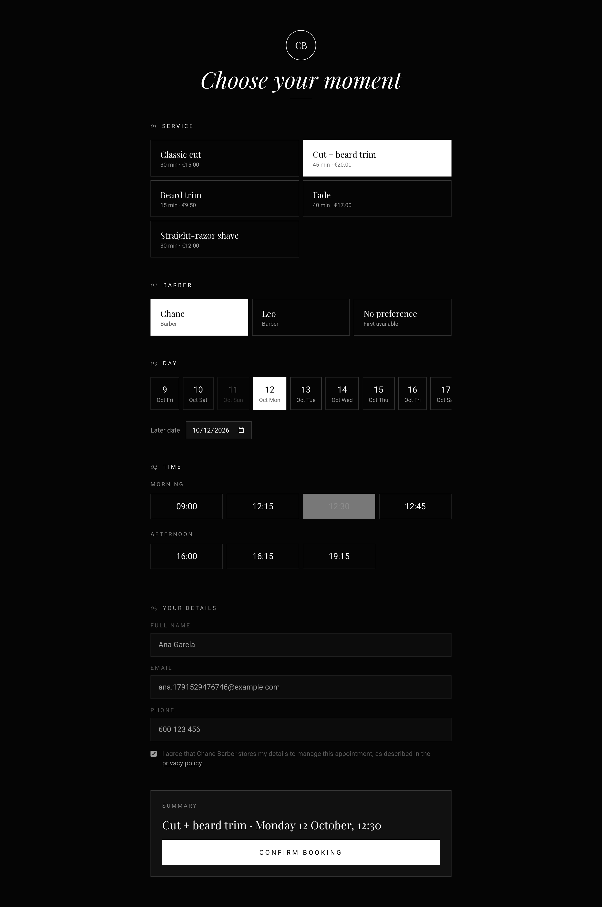
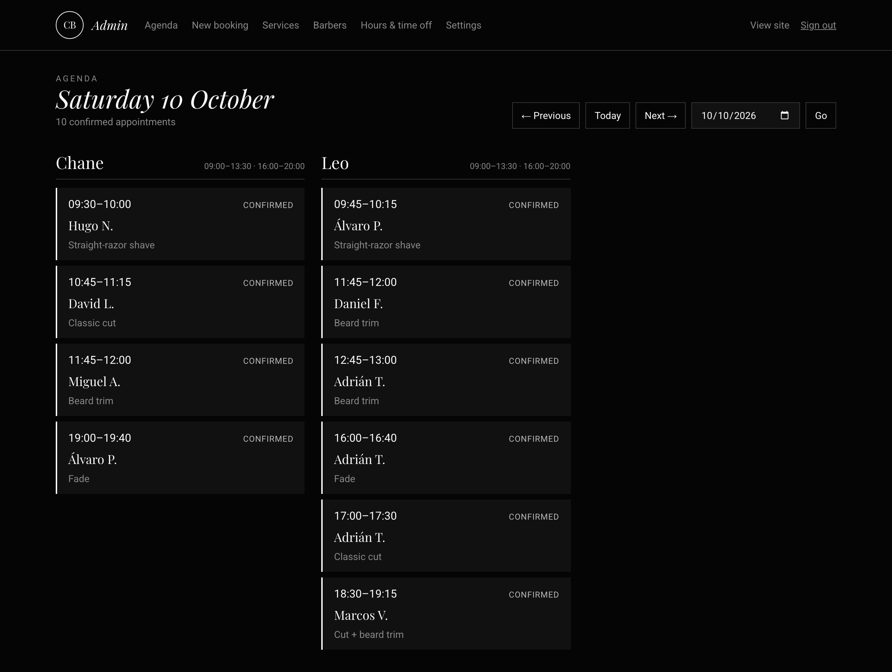
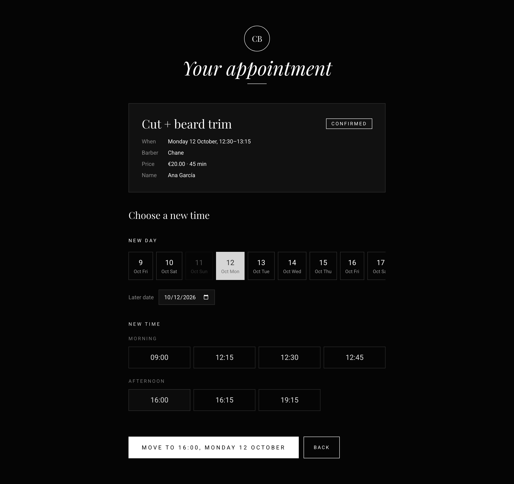
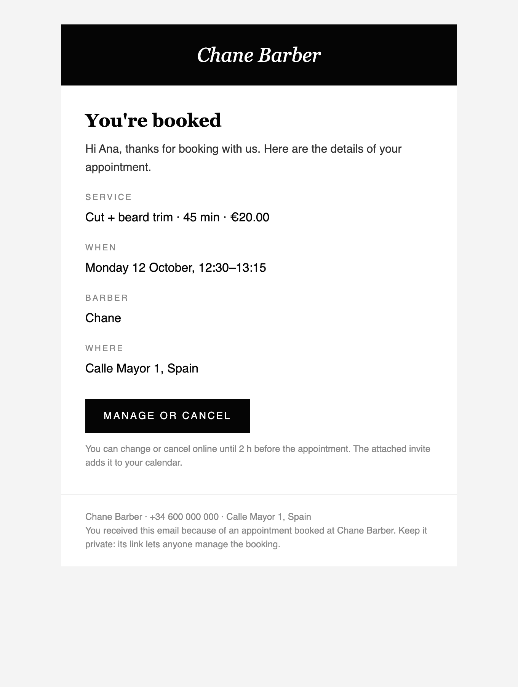
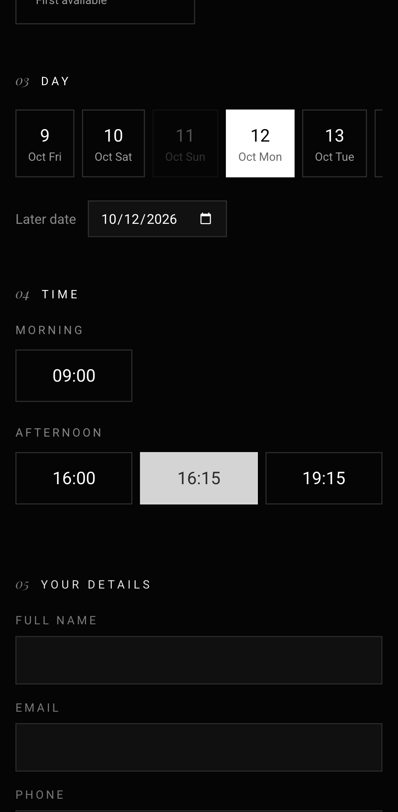

# barber-booking

[](https://github.com/alexestepagallego/barber-booking/actions/workflows/ci.yml)


Online booking for a real barbershop,
[Chane Barber](https://github.com/alexestepagallego/chanebarber), built the
way a production system should be: **double bookings are impossible, not
just unlikely**, and that is proven by tests that release up to 100 overlapping booking requests at once against a real database.

<p align="center">
  
</p>

## Why this project is interesting

Most booking sites check "is this time free?" and then save the booking.
Two customers who submit at the same moment both pass the check, and both
get the slot. Here the **database itself** refuses overlapping
appointments:

```sql
EXCLUDE USING gist (barber_id WITH =, tstzrange(starts_at, ends_at, '[)') WITH &&)
  WHERE (status = 'confirmed')
```

Building on that:

- **Proven under real concurrency.** 50 simultaneous requests for one slot
  give exactly 1 booking. 100 random overlapping requests give 0
  overlaps, and no request is wrongly rejected. A counter-example test
  shows the naive approach booking all 50.
  [How it works →](docs/concurrency.md)
- **A database-level semaphore.** Under heavy contention the constraint
  alone caused deadlock storms, and the tests caught it. Writes now queue
  per barber with `pg_advisory_xact_lock`, while different barbers still
  book in parallel. [ADR 0002 →](docs/adr/0002-per-barber-advisory-lock.md)
- **Every other write is just as careful.** Reschedules, cancellations,
  reminders and admin edits use conditional updates or row locks. When two
  of them race, one wins cleanly and the other gets a clear message,
  never a silent overwrite.
- **Time zones done right.** Opening hours are wall-clock times in the
  shop's zone, turned into exact instants per day. Tested on both
  daylight-saving days, when a day lasts 23 or 25 hours.
  [How availability works →](docs/availability.md)
- **Secure by design.**
  - Manage links are HMAC-derived and stored only as hashes; admin session tokens are random and also stored only as hashes.
  - Passwords use argon2id.
  - Rate limits are counted in Postgres.
  - Bookings are bot-checked with Cloudflare Turnstile.
  - A strict static CSP; no personal data in logs; GDPR data erasure.

  [Threat model →](docs/security.md)

## Features

**Customers**

- Pick a service, a barber or "no preference", a day and a time. Each
  service has its own duration.
- If someone takes your time while you fill in the form, you get a clear
  message, the times refresh, and your details stay filled in.
- An email confirmation with a calendar invite. Change or cancel the
  appointment from a private link until 2 h before.
- A reminder the day before, with updated invites after every change.

**Staff (admin panel)**

- A daily agenda per barber, and walk-in or phone bookings that are not
  held to the minimum notice.
- Move, cancel, or mark appointments as completed or no-show, with the
  full history of each one.
- Manage services, barbers, weekly hours (split shifts), holidays and
  absences, and the booking rules.

<table>
  <tr>
    <td></td>
    <td></td>
  </tr>
  <tr>
    <td></td>
    <td></td>
  </tr>
  <tr>
    <td></td>
    <td></td>
  </tr>
</table>

## Tech stack

|              |                                                                                        |
| ------------ | -------------------------------------------------------------------------------------- |
| App          | Next.js 16 (App Router, Cache Components, Server Actions), React 19, TypeScript strict |
| Data         | PostgreSQL 17 (Neon in production), Drizzle ORM, SQL migrations                        |
| Validation   | Zod, the same schemas on client and server                                             |
| Email        | Resend + React Email; RFC 5545 invites written by hand                                 |
| Security     | Cloudflare Turnstile, argon2id, rate limiting in Postgres, CSP                         |
| Tests        | Vitest (unit + integration on real Postgres), Playwright + axe-core                    |
| CI / hosting | GitHub Actions, Vercel (+ Vercel Cron)                                                 |

## Getting started

Requirements: Node.js 24+ and PostgreSQL 17 (Docker or a local install).

```bash
git clone https://github.com/alexestepagallego/barber-booking.git
cd barber-booking
npm install
cp .env.example .env.local
docker compose up -d                 # or use your own Postgres (edit .env.local)

npm run db:migrate                   # dev database
npm run db:migrate -- --test         # test database
npm run db:seed                      # demo barbers, services and opening hours
ADMIN_PASSWORD='a long passphrase' npm run admin:create -- you@example.com "Your Name"

npm run dev                          # http://localhost:3000 · admin at /admin
```

Locally, emails are saved as HTML files in `.mail/` so you can open them in
a browser. Turnstile is skipped until its keys are set.

## Testing

| Suite                                               | Tests | Command                    |
| --------------------------------------------------- | ----- | -------------------------- |
| Unit                                                | 62    | `npm run test:unit`        |
| Integration and concurrency (real Postgres)         | 91    | `npm run test:integration` |
| End-to-end, desktop + mobile, on a production build | 28    | `npm run test:e2e`         |

CI runs formatting, lint, type checks, a schema-drift check, all three suites and a production build on every push to `main` and every pull request. The suites found real bugs
along the way, and two adversarial multi-agent code reviews confirmed and
fixed about 40 more distinct issues. [Testing →](docs/testing.md)

## Documentation

|                                                          |                                                           |
| -------------------------------------------------------- | --------------------------------------------------------- |
| [Architecture](docs/architecture.md)                     | layers, request flows, caching, Next.js 16 specifics      |
| [Data model](docs/data-model.md)                         | ER diagram and the invariants the database enforces       |
| [How double bookings are prevented](docs/concurrency.md) | the constraint, the lock, every other write path          |
| [How availability is computed](docs/availability.md)     | the engine, split shifts, daylight saving                 |
| [HTTP API](docs/api.md)                                  | endpoints, errors, rate limits                            |
| [Security](docs/security.md)                             | threat model, secrets, rotation, GDPR                     |
| [Testing](docs/testing.md)                               | what each suite proves                                    |
| [Deployment](docs/deployment.md)                         | Neon, Vercel, Resend, Turnstile, first admin, public demo |

**Architecture decision records**

1. [Enforce "no overlap" in the database](docs/adr/0001-database-enforced-no-overlap.md)
2. [Per-barber advisory lock](docs/adr/0002-per-barber-advisory-lock.md)
3. [HMAC-derived manage links](docs/adr/0003-hmac-derived-manage-links.md)
4. [Own database sessions for the admin panel](docs/adr/0004-admin-authentication.md)
5. [Rate limiting in Postgres](docs/adr/0005-rate-limiting-in-postgres.md)
6. [Static CSP instead of nonces](docs/adr/0006-static-csp.md)
7. [Emails after the response](docs/adr/0007-emails-after-response.md)

## Project structure

```
drizzle/                 SQL migrations (0001 = the no-overlap constraint)
src/app/                 pages, API route handlers, admin panel (Server Actions)
src/components/          shared UI: booking steps, pickers, Turnstile widget
src/lib/                 pure code shared by client and server
src/server/booking/      availability, booking, manage links, locks
src/server/admin/        authentication, sessions, catalogue administration
src/server/email/        templates, transports, notifications, reminders
src/server/security/     tokens, rate limiting, Turnstile, headers
tests/                   Vitest: unit and integration
e2e/                     Playwright
docs/                    everything above, plus screenshots
```

## Status

All eight planned phases are done: the booking engine, the public flow,
manage links, emails and reminders, the admin panel, hardening with E2E
tests, a demo mode with nightly reset, and the documentation. The public
demo goes live once the Vercel, Neon and Resend accounts are connected
([deployment guide](docs/deployment.md)).

Built with Claude Code as an AI pair programmer. The tests and reviews
described above are how the result was checked.
