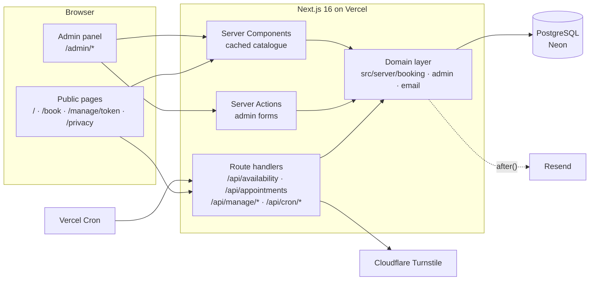
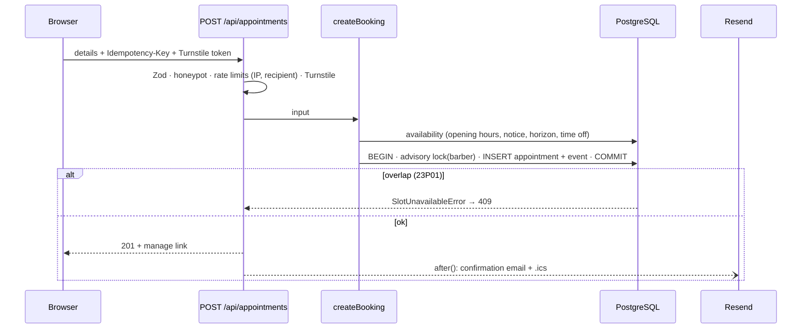

# Architecture

A single Next.js 16 application (App Router, React 19, TypeScript) on top of
PostgreSQL. There are no microservices and no queue: the database does the
hard parts (consistency, locking, counters), and the app stays thin.



## Layers

| Layer      | Folder                                                                   | Rules                                                                                                                                           |
| ---------- | ------------------------------------------------------------------------ | ----------------------------------------------------------------------------------------------------------------------------------------------- |
| UI         | `src/app/**/page.tsx`, `src/components`                                  | Server Components load data; client components only for interaction. Every user-visible time is formatted in the **shop's** time zone.          |
| HTTP       | `src/app/api/**/route.ts`, `src/app/admin/actions.ts`, `src/server/http` | Parse with Zod, apply rate limits and the bot check, call the domain, map domain errors to status codes (`api-response.ts`). No business logic. |
| Domain     | `src/server/booking`, `src/server/admin`, `src/server/email`             | Business rules. Takes a `db` argument, so the same code runs in the app, the tests and the CLIs.                                                |
| Pure logic | `src/lib`, `src/server/booking/availability.ts`                          | No I/O and no clock: availability, calendar maths, iCalendar, schemas. Exhaustively unit-tested.                                                |
| Data       | `src/server/db`, `drizzle/`                                              | Drizzle schema plus SQL migrations. Invariants that must never break are database constraints, not app code.                                    |

## Key flows

### Booking



- Availability is only a hint. The **exclusion constraint** decides, with a
  per-barber advisory lock to avoid deadlock storms
  ([concurrency.md](concurrency.md)).
- "No preference" tries the free barbers, least booked first.
- A retry with the same `Idempotency-Key` returns the original booking.
  It skips the Turnstile check, because Turnstile tokens are single-use.

### Manage link

`/manage/<token>` shows the appointment. Cancel and reschedule go through
`/api/manage/*`, with the token in `Authorization: Bearer` so it never
appears in API URLs or access logs.

- Every change is a conditional `UPDATE` that repeats its preconditions
  (still confirmed, same start time and barber). When two changes race,
  one wins and the other gets a clear "this appointment was just changed".
- A reschedule takes the same lock and hits the same constraint as a new
  booking.
- Customers can change a booking online until the cutoff (default 2 h
  before); staff can change it at any time.

### Admin panel

Server Components behind `requireAdmin()`, plus Server Actions for every
form. Catalogue edits call `updateTag("catalogue")`, so the public pages
show the change on the next request ([ADR 0004](adr/0004-admin-authentication.md)).

### Scheduled jobs (Vercel Cron, `vercel.json`)

| Job                     | When (UTC)  | Does                                                                                                           |
| ----------------------- | ----------- | -------------------------------------------------------------------------------------------------------------- |
| `/api/cron/reminders`   | 16:00 daily | Day-before reminders, with per-row claims and retries ([ADR 0007](adr/0007-emails-after-response.md))          |
| `/api/cron/maintenance` | 02:30 daily | Erases customer data past retention, purges expired sessions and rate-limit rows, resets the demo in demo mode |

Both require `Authorization: Bearer $CRON_SECRET`, compared in constant
time.

## Caching

Only the **catalogue** is cached: shop settings, services, barbers and
opening hours. `getCatalogue()` uses `'use cache'` with
`cacheLife("hours")` and `cacheTag("catalogue")`:

- Admin edits invalidate it with `updateTag`.
- The demo reset invalidates it with `revalidateTag(…, { expire: 0 })`.
- Pages call `connection()` before reading it, so `next build` never needs
  a database.

Availability, appointments and anything behind a token or session are
**never cached**.

## Next.js 16 specifics this code relies on

These are written down because they differ from older Next.js habits. The
installed docs in `node_modules/next/dist/docs` are the reference:

- **Cache Components / PPR.** Any runtime data (params, cookies, DB reads,
  the clock) must sit inside `<Suspense>`, after `connection()` where the
  clock is used. Without it the build fails.
- **`proxy.ts`** replaces `middleware.ts`. It only does an optimistic
  cookie check; authorization happens in each page and action.
- **Server Actions are public endpoints.** Each one calls `requireAdmin()`
  itself; layouts are not a security boundary.
- **`updateTag`** works only in Server Actions. Route handlers and crons
  use `revalidateTag(tag, profile)`, whose second argument is required.
- **`after()`** runs even if the response failed, so it is only scheduled
  after a successful commit.
- **`<Activity>`** keeps previous pages mounted on client navigation.
  Logout is therefore a full page load, and the Turnstile widget cleans up
  in its effect.
- **`notFound()` inside `<Suspense>`** is a soft 404: HTTP 200 plus
  `noindex`. That is accepted for unknown manage links.

## Repository map

```
drizzle/                 SQL migrations (0001 = no-overlap constraint)
src/app/                 routes: pages, API route handlers, admin panel
src/components/          shared UI (booking steps, pickers, Turnstile)
src/lib/                 pure code shared by client and server
src/server/booking/      availability, booking, manage, locks, errors
src/server/admin/        auth, sessions, catalogue administration
src/server/email/        transports, templates, notifications, reminders
src/server/security/     tokens, rate limiting, Turnstile, headers
src/server/db/           schema, client, migrate, seed
src/proxy.ts             optimistic admin redirect
tests/unit|integration/  Vitest (integration = real Postgres)
e2e/                     Playwright against a production build
scripts/screenshots/     README screenshots and GIF
```
