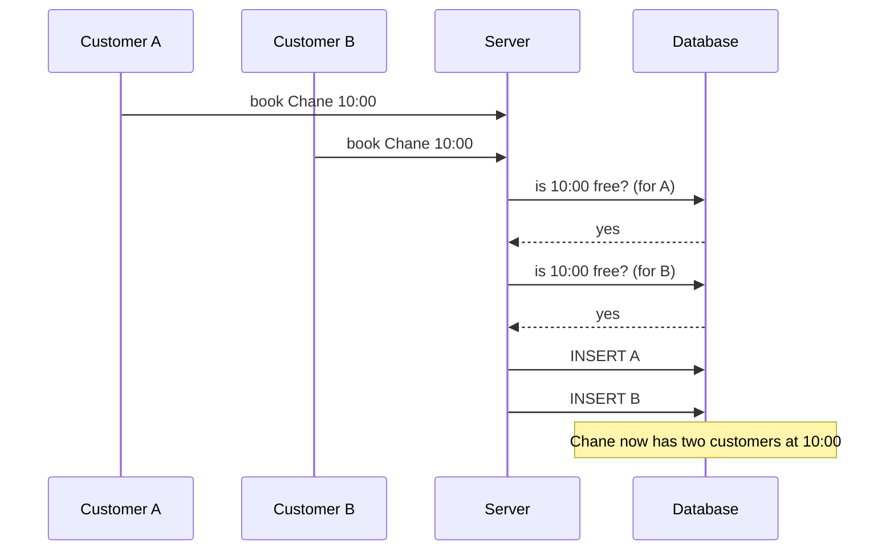
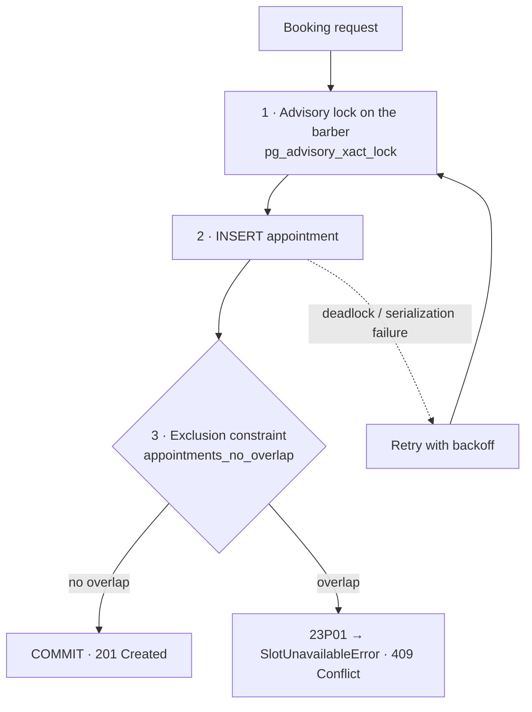

# How double bookings are prevented

This document explains the guarantee, how it is implemented, and how the
test suite proves it. The design decisions behind it are recorded in
[ADR 0001](adr/0001-database-enforced-no-overlap.md) and
[ADR 0002](adr/0002-per-barber-advisory-lock.md).

## The guarantee

> A barber never has two **confirmed** appointments whose time ranges
> overlap, regardless of how many requests arrive at once or how many app
> instances are running.

## The problem with "check, then book"



Both checks run before either insert, so both pass. Running the check and
the insert inside a normal (`READ COMMITTED`) transaction does not help,
because neither transaction can see the other's uncommitted row.

The test suite reproduces this on purpose. The counter-example in
`tests/integration/concurrency.test.ts` runs 50 concurrent check-then-insert
requests against a table without the constraint, and **all 50 get booked**.

## The solution: three layers



| Layer                        | Purpose                                                                                            | If it were missing                                              |
| ---------------------------- | -------------------------------------------------------------------------------------------------- | --------------------------------------------------------------- |
| **Exclusion constraint**     | The guarantee itself. Postgres refuses any overlapping confirmed row, atomically.                  | Double bookings.                                                |
| **Advisory lock per barber** | Makes concurrent writes for the same barber run one at a time, so they cannot deadlock each other. | Still correct, but slow under contention (deadlock storms).     |
| **Retry on 40P01 / 40001**   | Safety net for transient aborts.                                                                   | A rare request could fail with a 500 instead of a clean answer. |

### 1. The exclusion constraint

```sql
EXCLUDE USING gist (
  barber_id WITH =,
  tstzrange(starts_at, ends_at, '[)') WITH &&
) WHERE (status = 'confirmed')
```

Read it as: _"reject the row if another confirmed row has the same barber
**and** an overlapping time range."_ The GiST index makes the overlap lookup
fast, and `btree_gist` lets that index also compare the `uuid` barber id.

The half-open range `[)` means an appointment that ends at 10:30 and one
that starts at 10:30 are back-to-back, not overlapping.

### 2. The advisory lock

```sql
SELECT pg_advisory_xact_lock(7301, hashtext(:barber_id));
```

This is the "semaphore" of the system: a mutex keyed by barber, held by the
database until the transaction ends. See `src/server/booking/schedule-lock.ts`.

### 3. Translating errors

`src/server/booking/appointments-repository.ts` never asks whether a slot
is free. It inserts, and:

- `23P01` on `appointments_no_overlap` → `SlotUnavailableError` → HTTP 409, unless the request's Idempotency-Key matches an existing booking, which is then returned instead (a replay can trip either constraint).
  The UI refreshes the available times and keeps the form data.
- `23505` on `appointments_idempotency_key_hash_unique` → the request is a retry
  of one that already succeeded, so it returns the original booking instead
  of an error. This covers double taps and network retries.

Availability shown in the UI is only a hint. Between showing a time and
submitting the form, someone else may take it, and the constraint is what
decides.

## Every other write follows the same rules

New bookings are not the only writes that can race. Each one either takes
a lock or compares, in its `UPDATE`, everything its decision was based on:

| Write                           | Protection                                                                                                                                   | If it loses the race                                                                                  |
| ------------------------------- | -------------------------------------------------------------------------------------------------------------------------------------------- | ----------------------------------------------------------------------------------------------------- |
| Reschedule (customer or staff)  | per-barber advisory lock + the exclusion constraint + `UPDATE … WHERE status = 'confirmed' AND starts_at = $old AND barber_id = $old`        | 409 "slot no longer available", or "this appointment was just changed"                                |
| Cancel                          | `UPDATE … WHERE status = 'confirmed' AND starts_at = $old AND barber_id = $old`                                                              | "this appointment was just changed" (or "no longer active" if the other change had already committed) |
| Completed / no-show             | `UPDATE … WHERE status = 'confirmed' AND starts_at = $old`                                                                                   | "this appointment was just changed"                                                                   |
| Reminder                        | claimed per appointment, right before sending, with `UPDATE … WHERE reminder_sent_at IS NULL AND status = 'confirmed' AND starts_at = $seen` | skipped; a failed send releases the claim                                                             |
| Weekly hours, barber's services | `SELECT … FOR UPDATE` on the barber row, then replace                                                                                        | waits, then replaces whole (never a merge of two versions)                                            |
| New service or barber           | unique slug, retried with the next suffix on conflict                                                                                        | gets `name-2`                                                                                         |
| Rate-limit counters             | one atomic upsert per hit                                                                                                                    | exact count under concurrency                                                                         |

The barber check in reschedule and cancel came from the adversarial review.
Comparing only the start time let a staff barber change and a customer
time change both succeed, with the second silently undoing the first. The
schedule lock came from the second review: two concurrent saves under
`READ COMMITTED` merged both versions into overlapping shifts.

## How it is tested

All of these run against a real PostgreSQL in CI (`npm run test:integration`).

| Test                                              | Asserts                                                                                                              |
| ------------------------------------------------- | -------------------------------------------------------------------------------------------------------------------- |
| 50 requests, same barber and time                 | Exactly **1** succeeds; the other 49 get `SlotUnavailableError`, with no other errors.                               |
| 50 "no preference" requests, 2 barbers            | Exactly **2** succeed, one per barber.                                                                               |
| 100 requests, random times, durations and barbers | **0** overlapping pairs in the database, **and** every rejection overlaps an accepted booking (no false rejections). |
| 50 raw inserts that skip the lock                 | Still exactly **1** row: the constraint holds on its own.                                                            |
| Counter-example without the constraint            | Check-then-insert books **all 50**.                                                                                  |

To make the races real, every request has its own pooled connection,
connections are opened before the race starts, and all requests wait on
the same promise before firing. The random test uses a seeded generator, so
a failure can be reproduced exactly.

The same file and its neighbours also race two cancellations, two
customers moving into the same time, a cancellation against a reschedule,
two overlapping reminder runs, two schedule saves, two identical service
creations, and 20 concurrent hits on a rate limit of 5.
