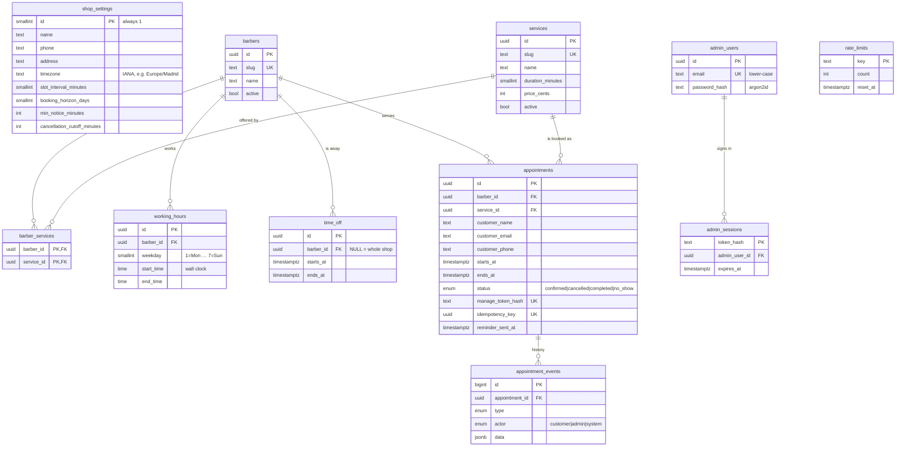

# Data model

PostgreSQL 17, managed with Drizzle (`src/server/db/schema.ts`) and plain
SQL migrations (`drizzle/`). Rules that must never break are enforced by
the database itself, with constraints and checks, so no code path can skip
them.

## Invariants enforced by the database

| Invariant                                                    | How                                                                                                                                                                                               |
| ------------------------------------------------------------ | ------------------------------------------------------------------------------------------------------------------------------------------------------------------------------------------------- |
| A barber never has two overlapping confirmed appointments    | `appointments_no_overlap`: `EXCLUDE USING gist (barber_id WITH =, tstzrange(starts_at, ends_at, '[)') WITH &&) WHERE status = 'confirmed'` ([ADR 0001](adr/0001-database-enforced-no-overlap.md)) |
| Appointments end after they start                            | `CHECK (ends_at > starts_at)` (also on `time_off` and `working_hours`)                                                                                                                            |
| `cancelled_at` is set exactly when the status is `cancelled` | `CHECK ((status = 'cancelled') = (cancelled_at IS NOT NULL))`                                                                                                                                     |
| One booking per idempotency key                              | `UNIQUE (idempotency_key)`                                                                                                                                                                        |
| One shop settings row                                        | `CHECK (id = 1)`                                                                                                                                                                                  |
| Sensible services                                            | duration 1–480 min, price ≥ 0                                                                                                                                                                     |
| Admin emails are lower-case and unique                       | `CHECK (email = lower(email))` + `UNIQUE`                                                                                                                                                         |
| No deleting history by accident                              | `ON DELETE RESTRICT` from appointments to barbers and services: deactivate instead                                                                                                                |

## Design notes

- **Wall-clock vs instants.** Working hours are `time` columns, wall-clock
  times in the shop's zone, because the shop opens at 9 in summer and in
  winter. Everything that happens at a point in time is `timestamptz`.
  [availability.md](availability.md) explains the conversion.
- **Durations are fixed at booking time.** `ends_at` is stored, so changing
  a service's duration later never moves existing appointments.
- **Append-only history.** `appointment_events` records who did what
  (`customer`, `admin`, `system`) and is shown on the admin appointment
  page. Concurrency tests check that the history always matches the row.
- **Secrets are hashes.** Manage-link tokens and admin session tokens are
  stored only as SHA-256 hashes, and passwords as argon2id hashes.
- **Data minimisation.** The maintenance cron overwrites customer name,
  email and phone once an appointment is older than `DATA_RETENTION_DAYS`
  (default 365). The anonymous appointment stays for the agenda history.

## Migrations

| File                                   | Adds                                                                              |
| -------------------------------------- | --------------------------------------------------------------------------------- |
| `0000_initial_schema.sql`              | catalogue, schedule, appointments, events                                         |
| `0001_no_overlapping_appointments.sql` | `btree_gist` + the exclusion constraint (hand-written: Drizzle cannot express it) |
| `0002_shop_contact_details.sql`        | shop phone and address                                                            |
| `0003_admin_auth_and_rate_limits.sql`  | admin users, sessions, rate-limit counters                                        |

`npm run db:generate` creates a migration from schema changes. CI fails if
the schema and the migrations drift apart.
